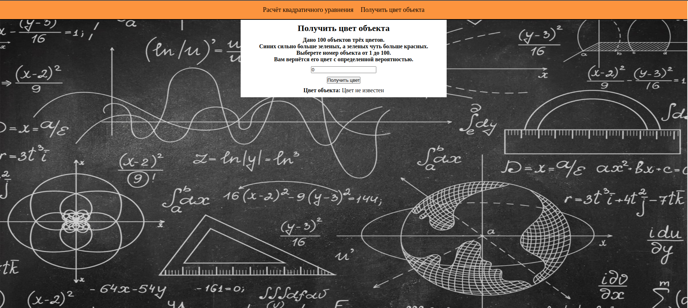
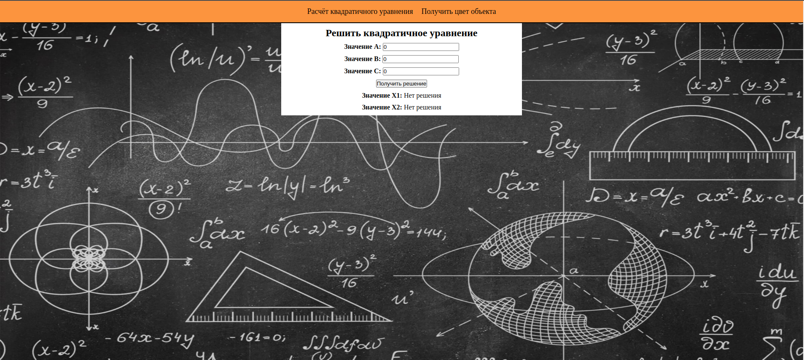

# Тестовое "БО-ЭНЕРГО"
## Автор
- [AlexeyPlz](https://github.com/AlexeyPlz)
## Проверка проекта
[](https://github.com/AlexeyPlz/Test_Energo/actions/workflows/codestyle.yml)
[](https://github.com/AlexeyPlz/Test_Energo/actions/workflows/test.yml)
## Стек
- Python 3.10
- FastAPI 0.98
- FastAPI REST 0.4.5
- SQLAlchemy 2.0.17
- PostgreSQL 13.2
- Asyncpg 0.27
- Alembic 1.11.1
- Uvicorn 0.22
- Pytest 7.4
- Pytest Asyncio 0.21
- HTTPX 0.24.1
- Aiosqlite 0.19
- JavaScript
- Vue3
## Задания
### Задание №1
Напишите сервис, который будет находить корни квадратного уравнения $a\cdot x^2 + b\cdot x + c = 0$.  
Самостоятельно определите наиболее оптимальную структуру возвращаемых данных.  
В качестве входных данных в сервис передаются значения a, b, c.
### Задание №2
Есть группа из 100 предметов. Предметы могут быть синего, зелёного и красного цвета.  
Известно, что предметов синего цвета сильно больше, чем предметов зелёного цвета, а предметов зелёного цвета немного больше, чем предметов красного цвета.  
Напишите сервис, который будет принимать номер предмета и пытаться угадать его цвет. Логику работы сервиса определите самостоятельно.
## Интерфейс



## Запуск локально
Проведите тесты:
```bash
pytest
```
Запустите контейнеры в фоновом режиме:
```bash
sudo docker-compose up -d
```
Проведите миграции:
```bash
sudo docker exec test_energo_backend_1 alembic upgrade head
```
Если есть проблема с фронтом, то необходимо удалить "front_build" и пересобрать зависимости:
```bash
cd frontend
npm install
cd ..
```
Если необходимы манипуляции с Docker:
```bash
sudo docker-compose up --build       # Пересобрать контейнеры
sudo docker-compose down             # Удаление контейнеров
sudo docker-compose down  --volumes  # Удаление контейнеров с томами
```
## Доступ после запуска
- http://localhost
- http://localhost/api/docs
